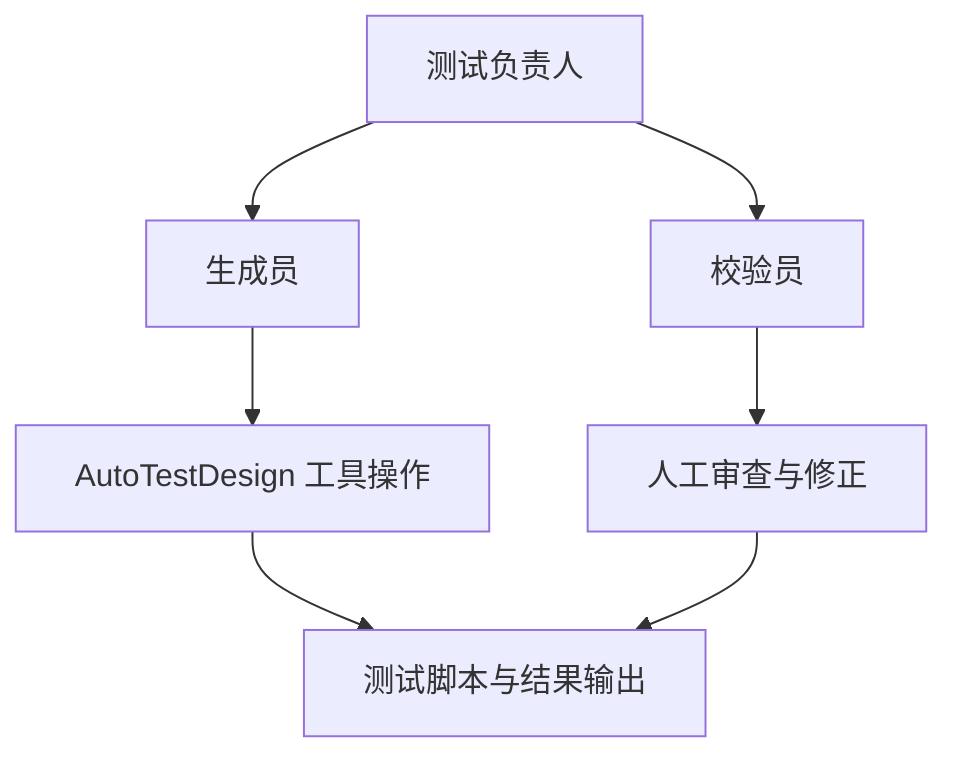

# 测试计划

项目名称：Task Management Platform（任务管理平台）  
测试工具：AutoTestDesign

## 1. 项目范围

### 背景

被测应用是一个基于 Flask + SQLite 实现的轻量级任务管理平台，包含用户认证、项目管理、任务管理 3 个主要模块。课程项目的目标不是单纯验证某个接口是否可用，而是构建一套自动化测试设计工具，并将其用于一个真实可运行的目标应用，完成需求分析、风险分析、测试设计、测试执行与结果评估。

本测试计划关注的是如何组织使用 AutoTestDesign 对目标应用开展测试活动，以及如何将工具辅助测试与人工对照测试结合起来。后续详细测试设计与执行文档将以任务管理模块（REQ-005、REQ-006、REQ-007）作为具体落地点。

### 总体目标

本轮测试活动的总体目标如下：

| 目标 | 说明 |
|------|------|
| 验证目标应用主要功能 | 验证任务管理平台主要模块是否符合需求 |
| 验证工具可用性 | 检验 AutoTestDesign 在真实项目上的适用性 |
| 建立需求到测试的追踪链 | 覆盖需求、风险、测试技术和测试用例之间的映射 |
| 对比测试效率 | 比较工具辅助测试与人工测试在时间与产出上的差异 |
| 支撑课程交付物 | 为风险分析、详细测试设计与执行文档提供计划依据 |

### 测试范围

**包含范围**

- 目标应用的功能需求分析与风险分析
- 黑盒测试设计与白盒测试设计
- 自动生成测试脚本与人工对照测试脚本
- 测试结果记录与缺陷归纳

**不包含范围**

- 前端 UI 可用性专项测试
- 性能压测与并发压测
- 渗透测试与深度安全专项测试
- 生产环境部署与运维验证

## 2. 测试项

### 主要功能性测试项

| 模块 | 需求 | 主要测试内容 |
|------|------|--------------|
| 用户认证 | REQ-001 ~ REQ-003 | 注册、登录、密码重置 |
| 项目管理 | REQ-004 | 项目创建、修改、删除、统计 |
| 任务管理 | REQ-005 ~ REQ-007 | 任务创建、更新、删除、分配、统计 |

### 非功能性关注点

虽然本项目不单独开展大规模非功能专项测试，但测试计划中仍然关注以下特性：

| 特性 | 关注点 |
|------|--------|
| 可靠性 | 对非法输入和异常路径的处理是否稳定 |
| 可维护性 | 需求、代码、测试用例之间能否建立清晰映射 |
| 可追踪性 | 风险分析、测试策略与执行结果是否能相互追溯 |
| 可用性 | 工具是否支持测试人员交互修改覆盖项、策略和用例 |

### 系统架构及主要组件

当前被测系统采用分层后端结构：

```text
flask_app/
├─ app.py
├─ config.py
├─ routes/
│  ├─ auth.py
│  ├─ projects.py
│  └─ tasks.py
├─ models/
│  ├─ database.py
│  ├─ project.py
│  └─ task.py
└─ utils/
   └─ validators.py
```

与测试活动直接相关的主要组件如下：

| 组件 | 文件 | 作用 |
|------|------|------|
| 认证路由 | `flask_app/routes/auth.py` | 注册、登录、密码重置 |
| 项目路由 | `flask_app/routes/projects.py` | 项目 CRUD、统计 |
| 任务路由 | `flask_app/routes/tasks.py` | 任务 CRUD、分配、按用户查询 |
| 数据模型 | `flask_app/models/task.py`、`project.py` | 任务与项目数据读写 |
| 校验器 | `flask_app/utils/validators.py` | 标题、状态、优先级等字段校验 |

## 3. 高级测试套件设计

### 风险驱动策略

根据风险分析，目标应用的测试资源按风险等级进行分配：

| 风险等级 | 对应需求 | 计划测试策略 |
|----------|----------|--------------|
| High | REQ-001 ~ REQ-003 | 优先覆盖认证与账户安全相关场景，强调输入校验与流程完整性 |
| Medium | REQ-004 ~ REQ-006 | 同时采用黑盒与白盒技术，覆盖输入、条件和关键路径 |
| Low | REQ-007 | 以统计逻辑正确性和接口一致性为主 |

### 测试套件规划

本项目计划围绕 5 类测试技术构建测试套件：

| 套件类别 | 适用需求 | 技术 | 设计目标 |
|----------|----------|------|----------|
| TS-BB-EP | 多数需求 | 等价类划分 | 识别有效/无效输入区间 |
| TS-BB-BVA | 边界敏感字段 | 边界值分析 | 覆盖长度、范围、临界值 |
| TS-BB-DT | 条件组合场景 | 判定表 | 覆盖主要条件组合与动作结果 |
| TS-WB-PC | 关键业务逻辑 | 路径覆盖 | 覆盖重要返回路径和异常路径 |
| TS-WB-ST | 有生命周期或状态流转的需求 | 状态转换 | 覆盖状态与状态迁移 |

### 技术选择理由

| 技术 | 适用原因 |
|------|----------|
| 等价类划分 | 目标系统存在大量字段校验场景 |
| 边界值分析 | 标题长度、日期、状态等字段适合边界测试 |
| 判定表 | 任务创建、分配和统计都存在明显条件组合 |
| 路径覆盖 | 路由层和模型层存在多条正常/异常路径 |
| 状态转换 | 任务生命周期和业务状态具备可建模性 |

## 4. 进度安排与检查清单

### 工具辅助测试流程

本项目采用“1 人生成 + 1 人校验”的协作方式组织工具辅助测试。总体流程如下：

| 阶段 | 活动 | 责任人 | 计划产出 |
|------|------|--------|----------|
| P1 | 导入需求与代码仓库 | 生成员 | 标准需求、需求-代码图 |
| P2 | 风险分析 | 生成员 | 风险等级、测试优先级、风险因素 |
| P3 | 黑盒测试设计 | 生成员 | EP / BVA / DT 分析表与测试用例 |
| P4 | 白盒测试设计 | 生成员 | 路径覆盖 / 状态转换结果 |
| P5 | 人工交互审查 | 校验员 | 修改后的覆盖项、策略和测试用例 |
| P6 | 导出与执行 | 生成员 + 校验员 | 可执行脚本与执行记录 |

### 人工对照测试流程

为了评估工具效果，计划进行人工对照测试：

| 阶段 | 活动 | 参与人 | 计划目标 |
|------|------|--------|----------|
| M1 | 人工阅读需求与代码 | 2 人 | 独立理解被测模块 |
| M2 | 人工设计测试用例 | 2 人 | 形成人工测试集 |
| M3 | 人工编写脚本 | 2 人 | 形成人工脚本 |
| M4 | 结果比对 | 2 人 | 对比覆盖面、时间与缺陷发现能力 |

### 测试级别与目标

| 测试级别 | 对象 | 目标 |
|----------|------|------|
| 功能级 API 测试 | 目标应用接口 | 验证需求行为是否符合规格 |
| 白盒结构测试 | 关键业务代码 | 验证重要路径和状态流转 |
| 结果复核 | 自动/人工脚本输出 | 区分被测应用缺陷与脚本问题 |

### 检查清单

| 检查项 | 目标 |
|--------|------|
| 需求已标准化 | 建立统一需求描述 |
| 风险已分级 | 为每条需求分配风险等级与优先级 |
| 至少 3 种黑盒技术 | 满足 FR 3.0 |
| 至少 1 种白盒技术 | 满足白盒测试要求 |
| 支持交互式审查 | 测试人员可修改覆盖项、策略和测试用例 |
| 能导出结构化工件 | 支持 JSON / 可执行测试脚本等输出 |

## 5. 组织架构

本项目测试活动的组织结构如下：



各角色职责如下：

| 角色 | 职责 |
|------|------|
| 测试负责人 | 统筹测试范围、测试策略、文档输出 |
| 生成员 | 导入需求与代码、运行 AutoTestDesign、生成测试资产 |
| 校验员 | 审查需求映射、风险分析、测试用例和执行结果 |

在人工对照测试阶段，两名成员共同参与需求复核、用例设计和结果比对，用于判断工具辅助测试相对人工测试的收益与局限。

## 6. 测试框架与理由

### 选择结果

本项目选择 **Pytest** 作为执行框架。

### 选择理由

| 理由 | 说明 |
|------|------|
| 与被测系统同语言 | 被测应用为 Python/Flask，测试框架也为 Python |
| 支持 Flask `test_client()` | 可在进程内直接执行接口测试 |
| 便于自动导出 | AutoTestDesign 可直接输出 Pytest 脚本 |
| 便于结果留档 | 命令行执行与失败报告清晰，适合课程项目使用 |

### 执行命令

```bash
python -m pytest test_scripts/test_generated.py -v --tb=short
python -m pytest test_scripts/test_generated_refined.py -v --tb=short
python -m pytest test_scripts/test_human.py -v --tb=short
```

## 7. 成本估算

### 工具辅助测试成本估算

以任务管理模块作为代表场景，计划将工具辅助测试成本估算为：

| 项目 | 估算值 |
|------|--------|
| 输入 token | 约 79,260 |
| 输出 token | 约 10,828 |
| 模型费用 | 约 ¥2 |
| 人工校验时间 | 约 1 小时 |
| 整体工具辅助流程时间 | 约 1 小时 |

### 人工对照测试成本估算

| 项目 | 估算值 |
|------|--------|
| 参与人数 | 2 人 |
| 整体人工测试时间 | 约 4 小时 |
| 额外工具成本 | 0 |

### 对比分析

| 指标 | 工具辅助测试 | 人工对照测试 |
|------|--------------|--------------|
| 总耗时 | 约 1 小时 | 约 4 小时 |
| 模型/工具费用 | 约 ¥2 | 0 |
| 人工参与方式 | 生成 + 校验 | 全流程人工设计与执行 |
| 预期结果产出 | 风险分析、分析表、测试脚本、执行记录 | 人工脚本与人工结果记录 |

注：工具当前为每条需求同时保留风险分数、风险等级和测试优先级，用于后续排序、筛选和测试资源分配。

### 成本结论

从计划角度看，自动化测试设计工具的主要价值在于：

1. 快速产出结构化测试资产；
2. 将人工工作从“从零设计”转变为“审查与修正”；
3. 在较低模型成本下缩短测试设计阶段耗时。

## 8. 结论

本测试计划用于说明如何使用 AutoTestDesign 对目标应用开展测试活动，而不是汇报具体测试结果。它定义了测试范围、测试项、测试技术、组织方式、执行框架和成本估算，为后续的详细测试设计与执行提供总体方案。

与本计划相关的具体执行结果、脚本对比和缺陷发现情况，将在详细测试设计与执行文档中展开。
